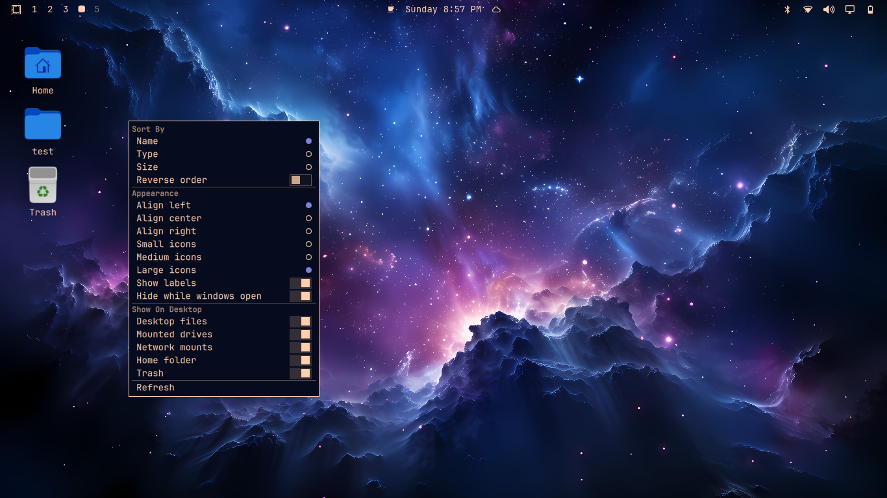

# Desktop Icons

Desktop icons for Omarchy: files and folders from `~/Desktop`, mounted drives,
network mounts, plus Home and Trash — with sorting, icon size, alignment, and
keyboard navigation that covers every feature.



## The Omarchy way

This is a native Omarchy **plugin**, built the way Omarchy expects plugins to
be built, so it behaves like the built-ins rather than like a bolted-on sidecar:

- **A manifest**: `manifest.json` declares `schemaVersion: 1`, a namespaced id
  (`io.github.linuts.desktop-icons`), a `service` kind, and the QML entry point.
  It passes `omarchy plugin validate` and the same checks the marketplace runs.
- **Runs inside the long-running shell**: no second Quickshell process, no
  privileged installers. The plugin shares the shell process, modules, and
  `qs.Ui`/`qs.Commons` styling Omarchy already ships.
- **Lists in the registry**: enable, disable, list, and remove it with the same
  `omarchy plugin` commands as any other plugin:
  `omarchy plugin list --json`.
- **A discoverable keybinding**: like every Omarchy keybinding, the desktop
  focus shortcut lives in your Hyprland config (user-owned, never rewritten by
  the plugin) and appears in the keybindings menu
  (`omarchy menu keybindings` → "Desktop icons").
- **Clean state**: settings persist to `~/.local/state/omarchy/desktop-icons/`,
  never inside the plugin folder, so plugin updates and reloads never lose your
  setup and removal leaves nothing behind.
- **IPC-first**: the shell talks to the plugin over `omarchy-shell`, the same
  channel Omarchy uses for every panel and service.

## Install

```sh
omarchy plugin add https://github.com/linuts/desktop-icons.git --enable
```

## Usage

Icons are drawn on the desktop layer below windows. The desktop shows:

- Files and folders from `~/Desktop`
- Mounted drives under `/run/media/$USER`, `/mnt`, or `/media`
- Network mounts (SSHFS, NFS, SMB/CIFS, Ceph, 9p, WebDAV, rclone)
- **Home** and **Trash** shortcuts

Left-click an item to open it. Right-click the desktop or an item to open the
settings menu. Every one of these actions also has a keyboard equivalent —
nothing requires the mouse (see below).

## Keyboard navigation — 100% keyboard-usable

The desktop is fully navigable and operable from the keyboard once focused,
and the settings menu is keyboard-navigable exactly like Omarchy's own menus.

### Step 1 — focus the desktop

Add a Hyprland binding (once — this is the same pattern all Omarchy
keybindings use). In `~/.config/hypr/bindings.lua`:

```lua
o.bind("SUPER + D", "Desktop icons", "omarchy-shell io.github.linuts.desktop-icons focus")
```

Then reload Hyprland:

```sh
hyprctl reload
```

You can also focus the desktop by clicking it. The binding shows up in the
Omarchy keybindings menu, so it is discoverable (`SUPER + D → Desktop icons`).

### Step 2 — navigate

With the desktop focused:

| Key            | Action                      |
| -------------- | --------------------------- |
| `SUPER + D`    | Focus the desktop icons     |
| `Tab`          | Next icon                   |
| `Shift+Tab`    | Open the context menu       |
| `←  ↑  ↓  →`   | Move the selection in 2D    |
| `Enter`        | Open the selected item      |
| `Esc`          | Leave keyboard navigation   |

The selection moves across the icons in the visible grid, not a flat list, so
arrow keys feel like a real desktop.

### Step 3 — drive the menu from the keyboard

The context menu is a full keyboard citizen, mirroring Omarchy's menu
conventions (`PanelKeyCatcher`-style focus handling):

| Key               | Action                          |
| ----------------- | ------------------------------- |
| `Tab` / `↓`       | Next setting row                |
| `Shift+Tab` / `↑` | Previous setting row            |
| `Enter`           | Toggle / apply the highlighted row |
| `Esc`             | Close the menu, keep navigating |

So the entire workflow — focus the desktop, move to an icon, open its menu,
change any setting, close it, keep going — happens without the mouse.

To release the desktop without a keypress:

```sh
omarchy-shell io.github.linuts.desktop-icons unfocus
```

## Configure

The settings menu (right-click, or `Shift+Tab` while keyboard navigation is
active) offers:

- **Sort By**: Name, Type, or Size, with optional reverse order
- **Appearance**: Align left/center/right, icon size (small/medium/large), and
  whether labels are shown
- **Hide while windows open**: hide the icons when any window is on the
  workspace
- **Show On Desktop**: toggle Desktop files, Mounted drives, Network mounts,
  Home folder, and Trash
- **Refresh**: rescan the desktop and mounts

Settings persist to `~/.local/state/omarchy/desktop-icons/config.json`.

### IPC

```sh
omarchy-shell io.github.linuts.desktop-icons refresh          # rescan
omarchy-shell io.github.linuts.desktop-icons focus            # enter keyboard nav
omarchy-shell io.github.linuts.desktop-icons unfocus          # leave keyboard nav
omarchy-shell io.github.linuts.desktop-icons listItems        # dump state as JSON
```

## Remove

```sh
omarchy plugin remove io.github.linuts.desktop-icons
```

Remove the plugin's state if you want a clean sweep:

```sh
rm -rf ~/.local/state/omarchy/desktop-icons
```

If you added the `SUPER + D` keybinding above, delete that `o.bind` line and
run `hyprctl reload`.

## License

MIT. See [LICENSE](LICENSE).